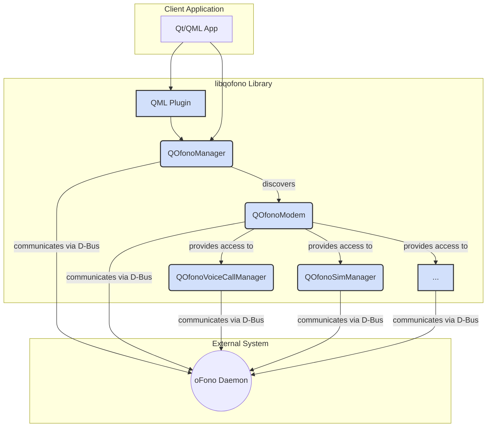
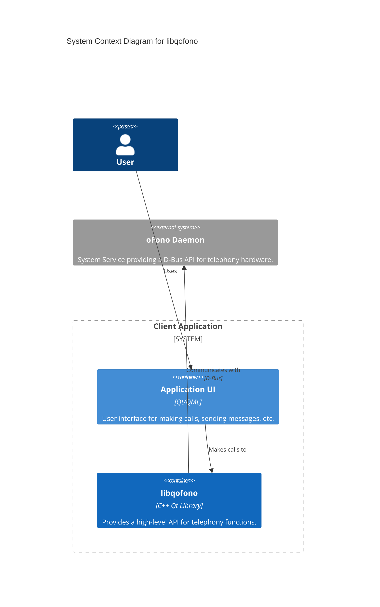
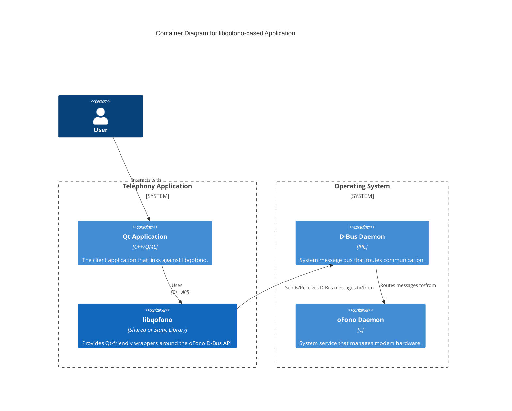

# libqofono

## Project Overview

**libqofono** is a C++ client library built with the Qt framework, designed to provide a high-level, object-oriented API for interacting with the oFono daemon. It serves as a facade, abstracting the complexities of low-level D-Bus communication into a developer-friendly, signal-slot-based interface for building telephony applications.

The primary purpose of this library is to simplify the integration of telephony functions into Qt and QML applications. It provides a comprehensive mapping of oFono's D-Bus objects and interfaces into a clean, asynchronous, and reactive C++ API.

### Key Features

*   **High-Level Abstraction**: Hides the complexity of D-Bus, offering a simple, object-oriented API.
*   **Asynchronous by Design**: Uses Qt's signals and slots for non-blocking operations.
*   **Comprehensive Feature Set**: Provides classes for Modem, SIM, Voice Call, SMS, Network, and Connection Management.
*   **QML Integration**: Includes a QML plugin to expose telephony features directly to Qt Quick applications.
*   **Reactive State Management**: Automatically keeps application state synchronized with the oFono daemon via D-Bus signals.

### Intended Use Cases

The library is intended for developers building applications on Linux-based platforms (including mobile and embedded systems) that require telephony functionality, such as:
*   Custom mobile phone dialers and messaging apps.
*   Automotive infotainment systems.
*   Embedded devices with cellular connectivity.
*   Desktop applications that need to interact with mobile modems.

## Table of Contents

*   [Project Overview](#project-overview)
    *   [Key Features](#key-features)
    *   [Intended Use Cases](#intended-use-cases)
*   [Architecture](#architecture)
    *   [High-Level Overview](#high-level-overview)
    *   [Technology Stack](#technology-stack)
    *   [Component Relationships](#component-relationships)
    *   [Key Design Patterns](#key-design-patterns)
*   [C4 Model Architecture](#c4-model-architecture)
    *   [Level 1: System Context Diagram](#level-1-system-context-diagram)
    *   [Level 2: Container Diagram](#level-2-container-diagram)
*   [Repository Structure](#repository-structure)
*   [Dependencies and Integration](#dependencies-and-integration)
*   [API Documentation](#api-documentation)
*   [Development Notes](#development-notes)
*   [Known Issues and Limitations](#known-issues-and-limitations)
*   [Additional Documentation](#additional-documentation)

## Architecture

### High-Level Overview

`libqofono` is architected as a client library that acts as a facade over the system's oFono D-Bus service. It does not run as a separate process but is integrated into a client application. Its core responsibility is to translate method calls from the application into D-Bus messages for oFono and to convert D-Bus signals from oFono into Qt signals for the application.

The architecture consists of two main layers:
1.  A **Core C++ Library** that contains proxy classes mapping one-to-one with oFono's D-Bus objects and interfaces.
2.  A **QML Plugin** that exposes these C++ components to the QtQuick declarative UI framework, enabling rapid development of user interfaces.

### Technology Stack

*   **Language**: C++
*   **Framework**: Qt
    *   **`QtCore`**: For the core object model, signals, and slots.
    *   **`QtDBus`**: For all communication with the oFono daemon.
    *   **`QtQml` / `QtQuick`**: For the optional QML plugin and test applications.
*   **Build System**: CMake

### Component Relationships

The components are organized hierarchically. An application uses the `QOfonoManager` to discover modems and then creates feature-specific classes (e.g., `QOfonoVoiceCallManager`) associated with a particular modem.

Component Relationship Diagram

### Key Design Patterns

*   **Facade**: The entire library simplifies the complex D-Bus API of oFono into a clean, high-level Qt API.
*   **Proxy**: Each `QOfono*` class acts as a local proxy for a remote D-Bus object managed by the oFono daemon.
*   **Singleton**: `QOfonoManager` is implemented as a singleton to provide a single, global point of access for modem discovery.
*   **Observer**: The Qt signals and slots mechanism is used extensively, allowing application components to react to telephony events (like an incoming call) in a decoupled manner.

## C4 Model Architecture

### Level 1: System Context Diagram

This diagram shows the system `libqofono` in the context of its users and dependencies.

C1: System Context Diagram

### Level 2: Container Diagram

This diagram breaks down the system into its high-level technical building blocks (containers).

C2: Container Diagram

## Repository Structure

The repository is organized with a clear separation between the core library, QML plugin, and test code.

*   `src/`: Contains the core C++ source code for the library.
*   `src/dbus/`: Contains XML definitions of the oFono D-Bus interfaces, which serve as the API contract.
*   `plugin/`: Contains the source for the QML plugin, which exposes the library's features to Qt Quick.
*   `ofonotest/`: A sample QML application demonstrating how to use the library.
*   `test/`: Contains unit and integration tests for the library.

## Dependencies and Integration

`libqofono` has one critical external service dependency.

*   **Service**: oFono Daemon
    *   **Description**: The Open Source Telephony daemon that must be running on the system. `libqofono` is a client to this service.
    *   **Integration**: Communication occurs over the system's D-Bus.
    *   **D-Bus Service Name**: `org.ofono`
    *   **Details**: The library dynamically discovers modem objects and their capabilities by interacting with the `org.ofono.Manager` interface at the root (`/`) object path. It then creates proxies for various other interfaces like `org.ofono.VoiceCallManager` and `org.ofono.SimManager` based on the modem's capabilities.

## API Documentation

The library provides a programmatic C++/QML API, not a network API. Interaction is achieved by instantiating and using the C++ classes defined in the library.

### Key API Classes

| Class | Description |
| :--- | :--- |
| `QOfonoManager` | The central entry point. Discovers and manages available modems. |
| `QOfonoModem` | Represents a single modem and provides access to its features. |
| `QOfonoSimManager` | Manages the SIM card (PIN, properties, etc.). |
| `QOfonoNetworkRegistration` | Handles network registration status and operator information. |
| `QOfonoVoiceCallManager` | Manages voice calls, including dialing, answering, and listing calls. |
| `QOfonoMessageManager` | Manages SMS messages. |
| `QOfonoConnectionManager` | Manages cellular data connections. |

### QML API

The library includes a QML plugin that exposes telephony features to Qt Quick. For detailed information and examples on how to use `libqofono` in QML, please refer to the:

*   **[QML Usage Guide](docs/QML_USAGE.md)**

## Development Notes

*   **Project Conventions**: The codebase follows standard Qt conventions, including the `QObject` parent-child model for memory management, the PIMPL (d-pointer) idiom to ensure binary compatibility, and extensive use of signals and slots for asynchronous communication.
*   **Testing**: The project includes a test suite in the `/test` directory that uses the `QtTest` framework. These tests should be run to validate changes before committing.
*   **Performance Considerations**: The library is designed to be efficient. It caches the state of oFono objects in memory and updates them reactively using D-Bus signals, which avoids the need for polling and reduces unnecessary IPC traffic.

## Known Issues and Limitations

*   **Tight Coupling to oFono API**: The library is a direct client of the oFono D-Bus API. Any significant or breaking changes in a new version of the oFono daemon will likely require corresponding updates to `libqofono`.
*   **Missing Features**: The analysis did not identify specific incomplete features, but any oFono D-Bus interfaces not represented by a class in the library are currently unsupported.

## Additional Documentation

The primary sources of documentation for this library are embedded within the repository itself.
*   **D-Bus Interface Definitions**: The XML files in `src/dbus/` provide a precise, machine-readable definition of the oFono API that this library consumes. They are the ultimate source of truth for low-level interactions.
*   **C++ Header Files**: The header files (`.h`) in `src/` serve as the main API documentation for developers using the library. They define the public classes, methods, properties, and signals available.
*   **oFono Project Documentation**: For semantics of the telephony operations, refer to the official documentation of the oFono project itself.
